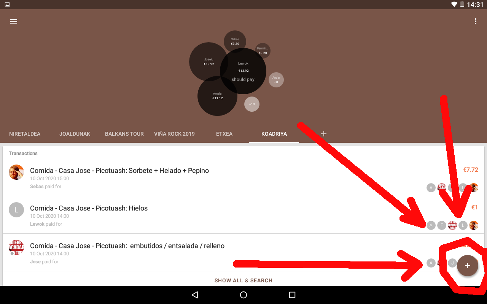
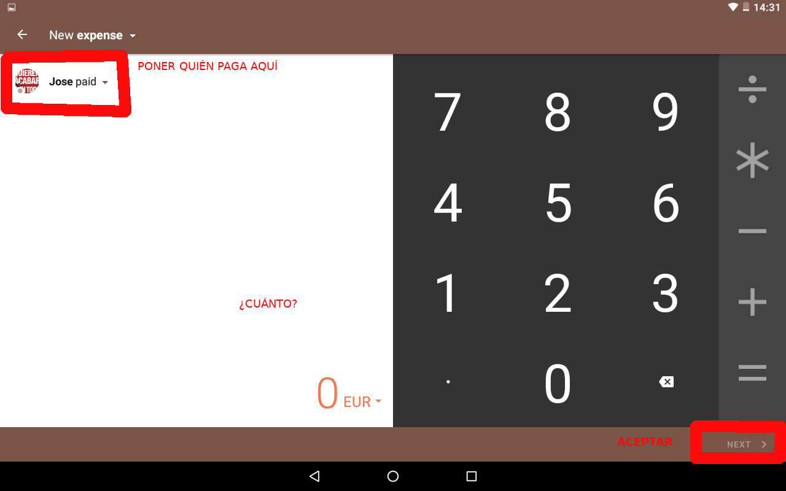
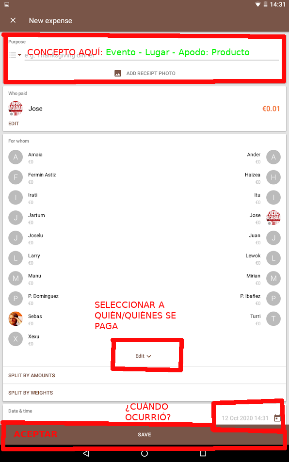
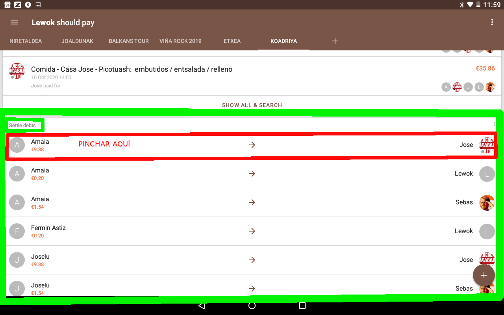
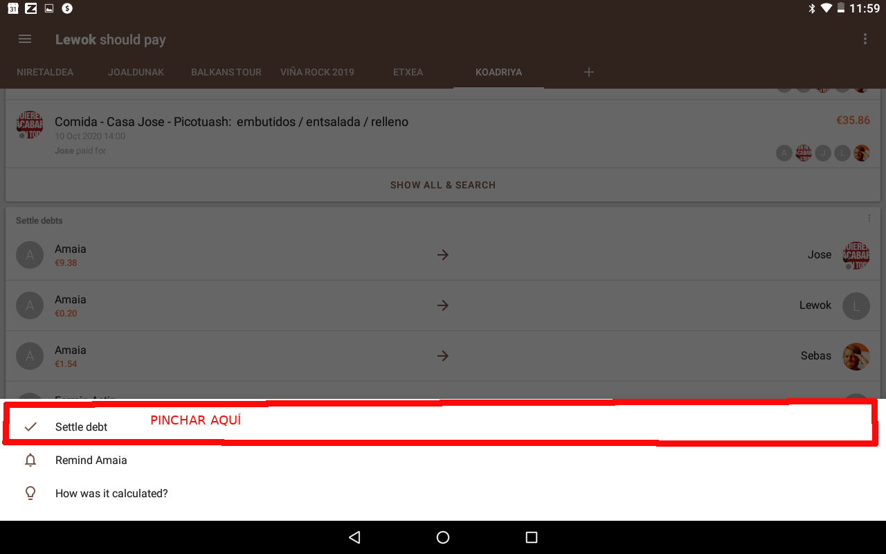
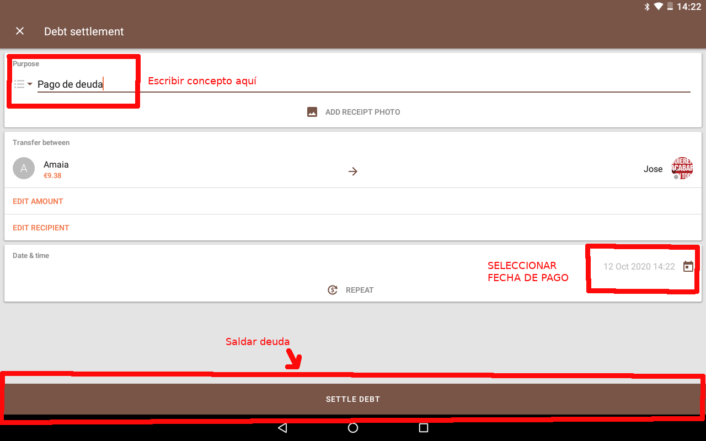

# Modo de uso de Settle Up en la cuadrilla

Como somos muchos y haremos transacciones diversas y aplicables a distintos subgrupos, intentamos mantener un protocolo de uso. 

Se distinguen dos casos de uso:

- Introducir deuda nueva
- Resolver deuda

Existen dos modos de funcionamiento de la aplicación

- En crudo: Cada transacción entre dos personas se resuelve individualmente

- Mínimas transacciones: La app calcula deudas entre miembros del grupo para minimizar el nº de transacciones 

Modo actual de funcionamiento: En crudo

## Introducir deuda nueva

A la hora de añadir una nueva deuda indicar:

- Fecha de la operación
- Seleccionar quién a pagado a quién/quiénes
- En el concepto de la deuda:
  - Ser descriptivos y concisos
  - No poner nombres de los implicados, eso ya se selecciona aparte
  - Seguir este patrón: **Evento - Lugar - Apodo: Producto**

Ejemplos del patrón:
- Comida - Casa Jose - Picotuash: General 
- Comida - Casa Jose - Picotuash: Inurrieta orchidea
- Comida - Casa Jose - Picotuash: Sorbete
- Comida - Casa Jose - Pollo: Hielos + Patatas
- Cena - La Única - Lubina: Pescaderia
- Cena - La Única - Pizzas caseras: Fritada (entrantes)
- Cerveceo  - Navarrería - Ciego lluvioso: Ronda de birra y pintxos
- Nochevieja - Lo viejo - Privas: Ron + Cocacola + Hielos

**Guía gráfica del proceso:**

## Resolver deuda

Cuando se quiera resolver la deuda, tras pagar al implicado, indicarlo en SettleUp con una nueva entrada:
- Seleccionar la deuda a saldar en la sección de deudas 
- Poner como concepto "Pago de deuda"
- Seleccionar fecha de pago

**Guía gráfica del proceso:**

